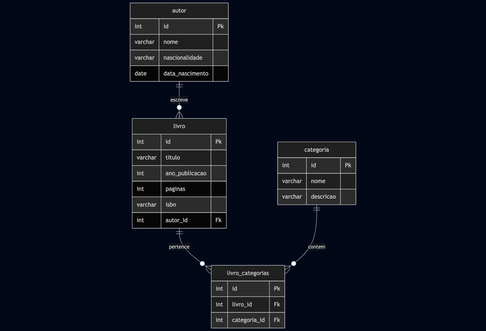

---

## `documentos/wad.md`

```markdown
# Web Application Document (WAD)

## Introdução

Este projeto consiste em uma aplicação web desenvolvida com Node.js e PostgreSQL. A arquitetura está organizada com separação de responsabilidades em controladores, modelos, serviços e migrações. O sistema é ideal para iniciantes e práticas acadêmicas em desenvolvimento backend com banco de dados relacional.

## Diagrama do Banco de Dados

O banco de dados foi modelado com base em uma estrutura simples contendo, por exemplo, uma tabela de usuários. As migrações estão em `/migrations/scripts` e seguem a ordem de execução por timestamp no nome do arquivo.

> O modelo físico do banco de dados está representado na imagem abaixo:


```
