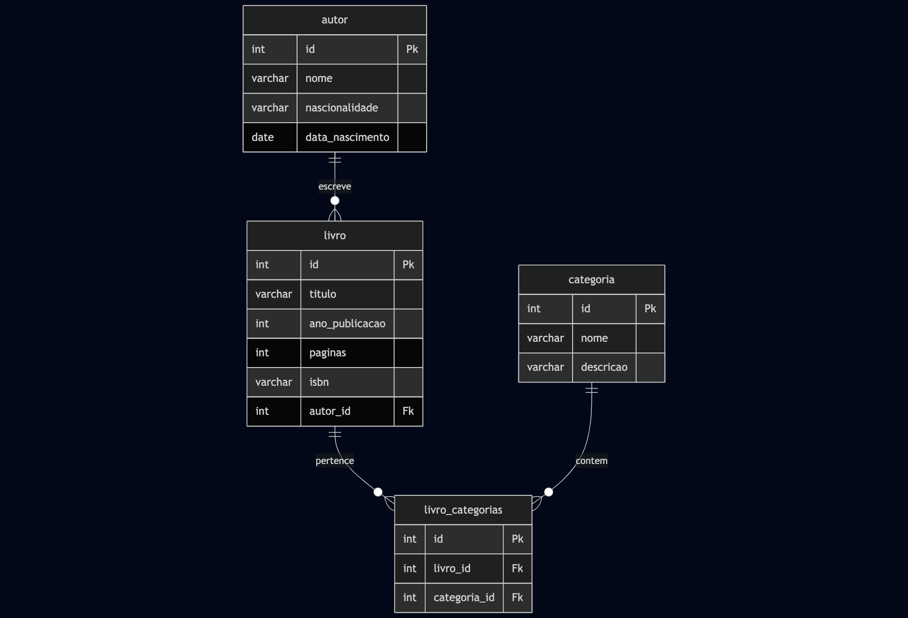

# Web Application Document (WAD)

## Introdução

Este projeto é uma aplicação web que utiliza **Node.js** como ambiente de execução e **PostgreSQL** como sistema gerenciador de banco de dados. A estrutura foi cuidadosamente organizada seguindo a arquitetura **MVC (Model-View-Controller)**, com separação clara de responsabilidades entre:

- **Modelos** (definem as entidades do sistema),
- **Controladores** (manipulam as requisições HTTP),
- **Serviços** (implementam regras de negócio),
- **Repositórios** (acessam diretamente o banco de dados),
- **Rotas** (definem os endpoints disponíveis).

## Diagrama do Banco de Dados

O banco de dados foi modelado de forma simples e eficiente, com o objetivo de armazenar informações relacionadas a **usuários**, **categorias** e **tarefas**.


> O modelo relacional do banco de dados está representado na imagem abaixo:



> O modelo físico do banco de dados está representado abaixo:

``` 
DROP TABLE IF EXISTS tasks;
DROP TABLE IF EXISTS categories;
DROP TABLE IF EXISTS users;

CREATE TABLE users (
  id SERIAL PRIMARY KEY,
  nome VARCHAR NOT NULL,
  email VARCHAR UNIQUE NOT NULL,
  senha VARCHAR NOT NULL
);

CREATE TABLE categories (
  id SERIAL PRIMARY KEY,
  nome VARCHAR NOT NULL
  user_id INTEGER REFERENCES users(id)
);

CREATE TABLE tasks (
  id SERIAL PRIMARY KEY,
  titulo VARCHAR NOT NULL,
  descricao TEXT,
  status VARCHAR NOT NULL,
  data DATE,
  user_id INTEGER REFERENCES users(id),
  categoria_id INTEGER REFERENCES categories(id)
);

```
> O Diagrama de arquitetura MVC está representado na imagem abaixo:


## Tecnologias Utilizadas
Node.js: Ambiente de execução para JavaScript no backend

Express.js: Framework web para criação do servidor HTTP

PostgreSQL: Banco de dados relacional

EJS: Motor de templates para renderização de páginas

Joi: Validação de dados

Bcrypt: Criptografia de senhas

Dotenv: Gerenciamento de variáveis de ambiente

## Funcionalidades Principais
Cadastro e login de usuários com senha segura

Criação de tarefas associadas a categorias

Edição, listagem e exclusão de tarefas

Sistema de categorias reutilizáveis

Separação por usuários (cada usuário só vê suas tarefas)

Interface visual simples com HTML, CSS e EJS

## Decisões Técnicas
Arquitetura MVC: facilita a manutenção e separação de responsabilidades.

Joi + Services: permite centralizar a lógica de negócio e garantir que dados inválidos não cheguem ao banco.

Repositórios separados: toda a lógica SQL fica concentrada em uma camada, o que facilita mudanças no banco futuramente.

Middleware com Express: controle de erros e corpo de requisições tratados globalmente.

EJS como template engine: simplicidade na criação de views dinâmicas sem dependência de frameworks pesados no frontend.


# Consultas SQL e Lógica Proposicional (Seção 3.5.2)
## Consulta 1: Buscar todas as tarefas de um usuário
```bash
SELECT * FROM tasks WHERE user_id = 1;
```
Expressão lógica:
P(x): x pertence às tarefas E x.user_id = 1

| x pertence a tasks | x.user\_id = 1 | Resultado |
| ------------------ | -------------- | --------- |
| V                  | V              | V         |
| V                  | F              | F         |
| F                  | V              | F         |
| F                  | F              | F         |


## Consulta 2: Listar categorias com pelo menos uma tarefa associada
```bash
SELECT DISTINCT c.nome 
FROM categories c
JOIN tasks t ON t.categoria_id = c.id;
```
Expressão lógica:
C(x): x é uma categoria ∧ ∃t (t pertence a tarefas ∧ t.categoria_id = x.id)

| x é categoria | t existe com categoria\_id = x.id | Resultado |
| ------------- | --------------------------------- | --------- |
| V             | V                                 | V         |
| V             | F                                 | F         |
| F             | -                                 | F         |


## Consulta 3: Buscar tarefas atrasadas
```bash
SELECT * FROM tasks WHERE data < CURRENT_DATE AND status != 'concluída';
```
Expressão lógica:
T(x): x pertence a tarefas ∧ x.data < hoje ∧ x.status ≠ 'concluída'

| x pertence a tasks | x.data < hoje | x.status ≠ 'concluída' | Resultado |
| ------------------ | ------------- | ---------------------- | --------- |
| V                  | V             | V                      | V         |
| V                  | V             | F                      | F         |
| V                  | F             | V                      | F         |
| F                  | -             | -                      | F         |

----

# Aprendizados e Desafios

## O que funcionou bem:
Separação de responsabilidades entre camadas MVC

Integração entre Node.js e PostgreSQL

Criptografia de senha com bcrypt

Validação robusta com Joi

Navegação funcional com EJS

## Desafios enfrentados:
Sincronização correta das chaves estrangeiras

Validação de dados no backend antes da inserção

Redirecionamento de rotas após autenticação

Organização das tabelas evitando duplicação e dependência circular

## Melhorias Futuras
Implementar autenticação com JWT ou sessões

Adicionar filtros por status ou data

Melhorar a aparência com CSS ou framework como Bootstrap

Permitir edição inline das tarefas na própria tabela

## Conclusão
O projeto atinge seu objetivo de ser um gerenciador de tarefas funcional com estrutura escalável, backend robusto e interface simples. A organização em MVC e uso de boas práticas permitem que o código seja de fácil manutenção e expansão futura.
