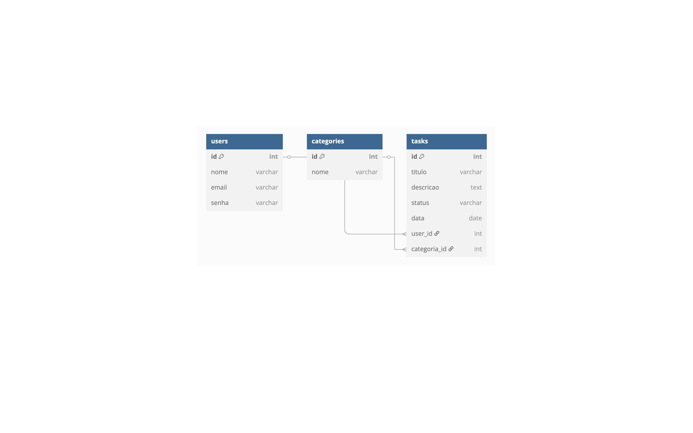

# Web Application Document (WAD)

## Introdução

Este projeto é uma aplicação web que utiliza **Node.js** como ambiente de execução e **PostgreSQL** como sistema gerenciador de banco de dados. A estrutura foi cuidadosamente organizada seguindo a arquitetura **MVC (Model-View-Controller)**, com separação clara de responsabilidades entre:

- **Modelos** (definem as entidades do sistema),
- **Controladores** (manipulam as requisições HTTP),
- **Serviços** (implementam regras de negócio),
- **Repositórios** (acessam diretamente o banco de dados),
- **Rotas** (definem os endpoints disponíveis).

## Diagrama do Banco de Dados

O banco de dados foi modelado de forma simples e eficiente, com o objetivo de armazenar informações relacionadas a **usuários**, **categorias** e **tarefas**.


> O modelo relacional do banco de dados está representado na imagem abaixo:



> O modelo físico do banco de dados está representado abaixo:

``` 
DROP TABLE IF EXISTS tasks;
DROP TABLE IF EXISTS categories;
DROP TABLE IF EXISTS users;

CREATE TABLE users (
  id SERIAL PRIMARY KEY,
  nome VARCHAR NOT NULL,
  email VARCHAR UNIQUE NOT NULL,
  senha VARCHAR NOT NULL
);

CREATE TABLE categories (
  id SERIAL PRIMARY KEY,
  nome VARCHAR NOT NULL
);

CREATE TABLE tasks (
  id SERIAL PRIMARY KEY,
  titulo VARCHAR NOT NULL,
  descricao TEXT,
  status VARCHAR NOT NULL,
  data DATE,
  user_id INTEGER REFERENCES users(id),
  categoria_id INTEGER REFERENCES categories(id)
);

```
> O Diagrama de arquitetura MVC está representado na imagem abaixo:

